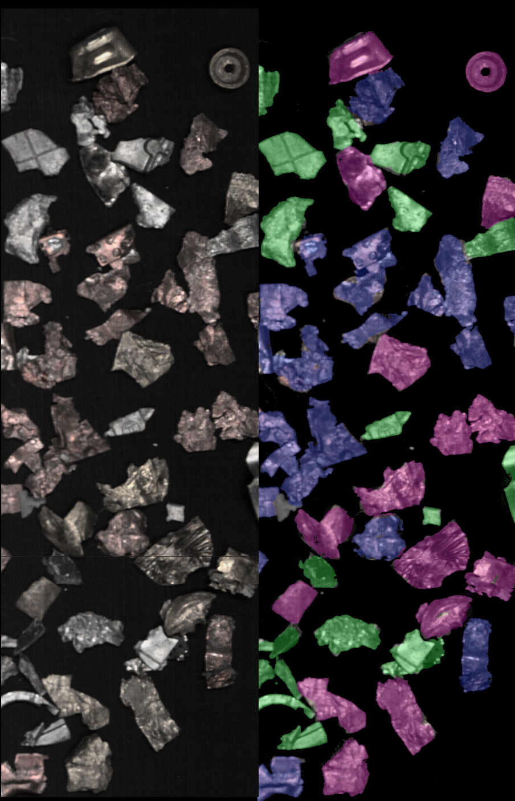
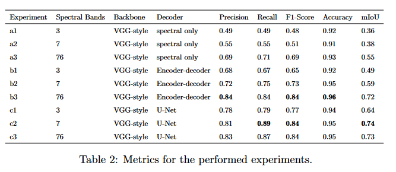
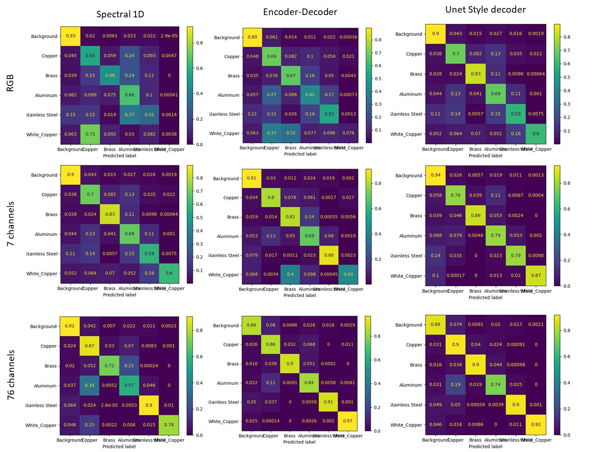
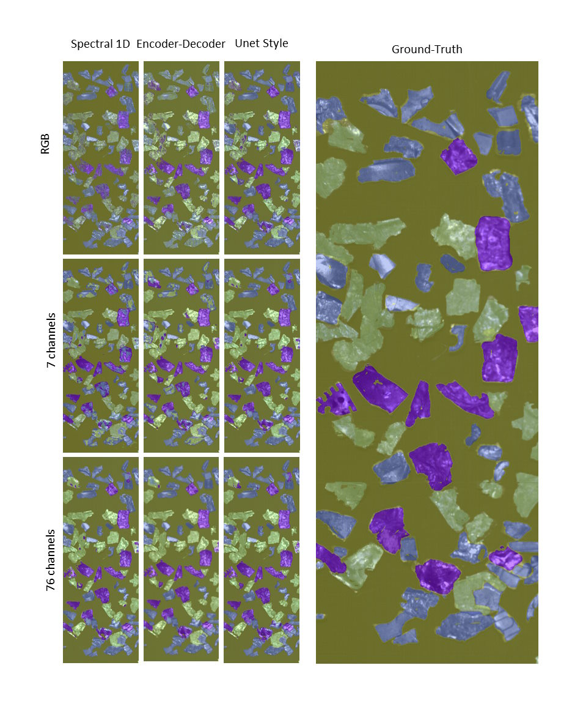

# Hyperspectral Dataset and Deep Learning methods for Waste from Electric and Electronic Equipment Identification (WEEE)

## Summary

Hyperspectral imaging, a rapidly evolving field, has witnessed the ascendancy of deep learning techniques, supplanting classical feature extraction and classification methods in various applications. However, many researchers employ arbitrary architectures for hyperspectral image processing, often without rigorous analysis of the interplay between spectral and spatial information. This oversight neglects the implications of combining these two modalities on model performance.

In this paper, we evaluate the performance of diverse deep learning architectures for hyperspectral image segmentation. Our analysis disentangles the impact of different architectures, spanning various spectral and spatial granularities. Specifically, we investigate the effects of spectral resolution (capturing spectral information) and spatial texture (conveying spatial details) on segmentation outcomes. 

Results show that incorporating spatial information alongside spectral data leads to improved segmentation results, and that it is essential to further work on novel architectures comprising spectral and spatial information.

Furthermore, we contribute to the field by cleaning and publicly releasing the Tecnalia WEEE Hyperspectral dataset. This dataset contains different non-ferrous fractions of Waste Electrical and Electronic Equipment (WEEE), including Copper, Brass, Aluminum, Stainless Steel, and White Copper, spanning the range of 400 to 1000 nm.

We expect these conclusions can guide novel researchers in the field of hyperspectral imaging. 

This work is based on the following publication:

Please, cite it as:

```bibtex
@article{picon2024analysis,
  title={On the analysis of adapting deep learning methods to hyperspectral imaging. Use case for WEEE recycling and dataset},
  author={Picon, Artzai and Galan, Pablo and Bereciartua-Perez, Arantza and Benito-del-Valle, Leire},
  journal={Spectrochimica Acta Part A: Molecular and Biomolecular Spectroscopy},
  pages={125665},
  year={2024},
  publisher={Elsevier}
}
```

## Dataset

Tecnalia Hyperspectral Dataset (\cite{picon2010automation}) contains different non-ferreous fractions of Waste from Electric and Electronic Equipment (WEEE) of Copper, Brass, Aluminum, Stainless Steel and White Copper. Images were captured by a hyperspectral Specim PHF Fast10 camera that is able to capture wavelengths in the range 400 to 1000 nm with a spectral resolution of less than 1 nm. The PHF Fast10 camera is equipped with a CMOS sensor (1024 × 1024 resolution), a Camera Link interface and a special Fore objective OL10. The provided dataset contains 76 uniformly distributed wave-lengths in the spectral range [415.05 nm, 1008.10 nm]. Illumination setup, as described in \cite{picon2012real}, was specifically designed to reduce the specular reflections generated by the surface of the non-ferrous materials and to provide a homogeneous and even illumination that covers the wavelengths sensitive to the hyperspectral camera. The illumination system consists of a parabolic surface that uniformly distributes the light generated by 9 halogens and 18 white LEDs covering the spectral range between 400 to 1000 nm.

Dataset is published in Zenodo (https://zenodo.org/records/12565131).

Cite it as: 
```bibtex
@inproceedings{picon2010automation,
  title={Automation of waste recycling using hyperspectral image analysis},
  author={Picon, Artzai and Ghita, Ovidiu and Iriondo, Pedro M and Bereciartua, Aranzazu and Whelan, Paul F},
  booktitle={2010 IEEE 15th Conference on Emerging Technologies \& Factory Automation (ETFA 2010)},
  pages={1--4},
  year={2010},
  organization={IEEE}
}
```

Download the dataset from Zenodo by running the following command:

```bash
curl -o dataset.zip https://zenodo.org/records/12565131/files/tecnalia_weee_hyperspectral_dataset_v1.0.zip?download=1
unzip dataset.zip -d dataset
```




## Implementations and results

We have implemented code to generate three different hyperspectral architectures and to test them under different spectral resolutions (RGB, 7 spectral bands and 76 spectral bands). Three different decoders are provided. One 1D spectral decoder that gets no spatial information,  one 2D spectral encoder-decoder that integrates spatial together with the spectral information and a UNet style decoder. The results of the experiments are shown in the table below.



Confussion matrices and predictions for the different combinations of number of spectral bands and decoders are shown below:






## Code

In this repository, we provide the code to replicate the experiments explained on the paper.


Execute the following command to install the requirements:

```bash
python3 -m pip install -r requirements.txt
```

Re-run the following command to run a specific experiment:

```bash
export experiment_params="params_e1.yaml"
# Train model
python core/train.py --params $experiment_params
# Evaluate model on train set
python core/evaluate.py --params $experiment_params --subset train
# Evaluate model on test set
python core/evaluate.py --params $experiment_params --subset test
```


